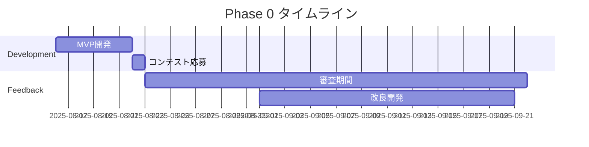

# 🗺️ 商用化ロードマップ

## 📅 フェーズ別展開計画

### 🚀 Phase 0: プロトタイプ期（2025年8-9月）

#### マイルストーン
- [x] M5Stack Contest応募（8/22）
- [ ] コンテスト結果発表（9月）
- [ ] フィードバック収集
- [ ] 改良版開発

#### 主要タスク


#### 成果物
- MVPデモ動画
- 技術仕様書v0.1
- ユーザーフィードバック

### 🏗️ Phase 1: 製品化準備期（2025年10月-2026年3月）

#### Q4 2025（10-12月）

**ビジネス基盤構築**
```
10月:
- 法人設立
- 特許出願（3件）
- チーム組成（3名）

11月:
- シード資金調達活動
- パイロット先選定
- 製品設計v1.0

12月:
- 資金調達クローズ（3,000万円）
- 開発環境整備
- 品質基準策定
```

**技術開発**
```
優先度高:
- セキュリティ強化
- API設計
- 管理画面開発

優先度中:
- AI精度向上
- マルチテナント対応
- ログ分析機能
```

#### Q1 2026（1-3月）

**パイロット展開**
```
対象: 5施設
期間: 3ヶ月
内容:
- 無償提供
- 週次フィードバック
- 改善サイクル実施

KPI:
- アラート精度: 85%以上
- 誤報率: 10%以下
- 満足度: 4.0/5.0以上
```

### 🎯 Phase 2: 市場投入期（2026年4月-2027年3月）

#### Q2 2026（4-6月）

**製品ローンチ**
```
4月: 
- 正式版リリース
- 価格発表
- 販売開始

5月:
- マーケティングキャンペーン
- メディア露出
- セミナー開催

6月:
- 10施設導入達成
- カスタマーサクセス体制
- 初期改善実施
```

**営業戦略**
```
チャネル構築:
- 直販: 2名体制
- 代理店: 3社契約
- オンライン: Web完備

価格戦略:
- 早期割引: 50%OFF
- 年間契約: 20%OFF
- 紹介特典: 10%還元
```

#### Q3 2026（7-9月）

**スケール準備**
```
目標:
- 25施設導入
- MRR 150万円
- チーム10名体制

施策:
- 導入事例公開
- 自動化推進
- パートナー拡大
```

#### Q4 2026（10-12月）

**成長加速**
```
目標:
- 50施設導入
- MRR 300万円
- 次期版開発着手

重点:
- 顧客満足度向上
- オペレーション効率化
- データ分析強化
```

#### Q1 2027（1-3月）

**Series A準備**
```
実績:
- ARR 4,000万円
- 成長率: 月20%
- NRR: 110%

調達活動:
- ピッチ資料作成
- DD準備
- 投資家面談
```

### 📈 Phase 3: 成長期（2027年4月-2028年3月）

#### 2027年度目標

**事業指標**
```
施設数: 200施設
ARR: 1.5億円
従業員: 25名
NPS: 50以上
```

**重点施策**

1. **製品拡張**
```
新機能:
- 介護記録連携
- 服薬管理
- リハビリ支援
- 家族連携
```

2. **市場拡大**
```
新セグメント:
- 訪問介護
- デイサービス
- 在宅介護
```

3. **地域展開**
```
優先地域:
- 関東: 40%
- 関西: 25%
- 中部: 20%
- その他: 15%
```

### 🌏 Phase 4: 拡大期（2028年4月-）

#### 海外展開計画

**Target Markets**
```
優先度1: アジア
- 台湾（2028 Q2）
- シンガポール（2028 Q3）
- 韓国（2028 Q4）

優先度2: 欧州
- ドイツ（2029）
- フランス（2029）
- 北欧（2030）
```

**展開戦略**
- 現地パートナー連携
- ローカライゼーション
- 規制対応

## 🔧 技術ロードマップ

### Version 1.0（2026 Q2）
```
基本機能:
✓ センサー統合
✓ アラート管理
✓ LINE通知
✓ 基本ダッシュボード
```

### Version 2.0（2026 Q4）
```
拡張機能:
+ AI予測機能
+ 詳細分析
+ API公開
+ マルチデバイス
```

### Version 3.0（2027 Q2）
```
エンタープライズ:
+ 介護記録連携
+ 音声アシスタント
+ 予防提案
+ 家族アプリ
```

### Version 4.0（2028 Q1）
```
次世代:
+ 自動介護計画
+ VR/AR連携
+ ロボット連携
+ グローバル対応
```

## 📊 財務ロードマップ

### 資金調達計画

```
2025 Q4: エンジェル（1,000万円）
2026 Q1: シード（3,000万円）
2027 Q1: Series A（1.5億円）
2028 Q1: Series B（5億円）
2029 Q1: Series C（15億円）
```

### 売上・利益計画

| 年度 | 売上 | 原価率 | 営業利益率 | EBITDA |
|-----|------|--------|-----------|--------|
| 2026 | 0.4億 | 60% | -100% | -0.4億 |
| 2027 | 1.5億 | 50% | -20% | -0.3億 |
| 2028 | 4.0億 | 40% | 10% | 0.4億 |
| 2029 | 10億 | 35% | 25% | 2.5億 |
| 2030 | 20億 | 30% | 35% | 7.0億 |

## 🏢 組織ロードマップ

### 採用計画

#### 2026年（10名）
```
Tech: 5名
- フルスタック: 2
- AI/ML: 1
- IoT: 1
- QA: 1

Business: 3名
- 営業: 2
- CS: 1

Corporate: 2名
- 経営企画: 1
- 経理: 1
```

#### 2027年（25名）
```
Tech: 12名
Business: 10名
Corporate: 3名
```

#### 2028年（50名）
```
Tech: 20名
Business: 23名
Corporate: 7名
```

### 組織文化

**コアバリュー**
1. User First - 利用者の尊厳を最優先
2. Innovation - 常に革新を追求
3. Transparency - 透明性の高い経営
4. Speed - 素早い意思決定と実行
5. Fun - 楽しく働く

## 🎯 KPI管理

### 北極星指標
**アクティブ利用施設数**

### レベル1 KPI
- MRR（月次経常収益）
- Churn Rate（解約率）
- NPS（顧客推奨度）

### レベル2 KPI
- CAC（顧客獲得コスト）
- LTV（顧客生涯価値）
- 従業員満足度

### 月次レビュー項目
```
Revenue:
- MRR成長率
- 新規/解約
- ARPU

Product:
- 機能利用率
- エラー率
- 応答速度

Customer:
- NPS
- サポート満足度
- 利用時間

Operation:
- 人件費率
- 採用進捗
- 生産性
```

## 🚨 リスク管理

### 事業継続計画（BCP）

#### シナリオ1: 資金調達失敗
```
対策:
- 最小チーム維持（5名）
- 機能限定版提供
- 売上重視へピボット
```

#### シナリオ2: 重大事故発生
```
対策:
- 即時対応チーム
- 保険加入（上限5億）
- 危機管理広報
```

#### シナリオ3: 競合の攻勢
```
対策:
- 差別化強化
- 価格戦略見直し
- M&A検討
```

## 📝 アクションアイテム

### 今後30日間

1. **Week 1**
   - [ ] コンテスト結果確認
   - [ ] チーム候補面談
   - [ ] 特許調査開始

2. **Week 2**
   - [ ] 法人設立準備
   - [ ] 投資家リスト作成
   - [ ] パイロット先アプローチ

3. **Week 3**
   - [ ] ピッチ資料作成
   - [ ] 製品改良設計
   - [ ] 価格戦略精査

4. **Week 4**
   - [ ] 投資家面談開始
   - [ ] パイロット契約
   - [ ] 採用活動開始

## 💪 成功への確信

### なぜ成功するか

1. **タイミング**: 市場ニーズが顕在化
2. **チーム**: 技術×介護の理解
3. **製品**: 明確な差別化
4. **実行力**: アジャイルな開発
5. **ビジョン**: 社会課題解決

### 3年後の姿

```
2028年8月：

ケア・コパイロットは
500施設、10,000床で稼働。

月間1,000件の異常を検知し、
50件の重大事故を防止。

介護者の残業を30%削減し、
利用者の笑顔を20%増加。

"介護の未来を変えた"
スタートアップとして認知。
```

---

## 🎯 Next Step

**今すぐやること**:
1. M5Stackコンテスト完遂
2. パイロット先確保
3. チームビルディング

**来月やること**:
1. 法人設立
2. 資金調達活動
3. 製品版開発着手

---

*From MVP to IPO - The Journey Begins Now*

---

*最終更新: 2025年8月16日*